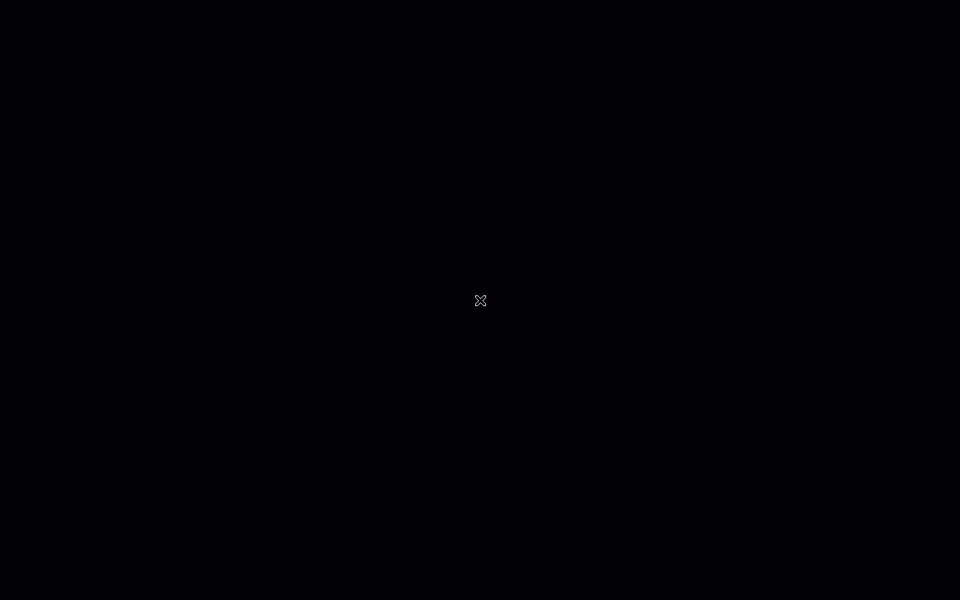
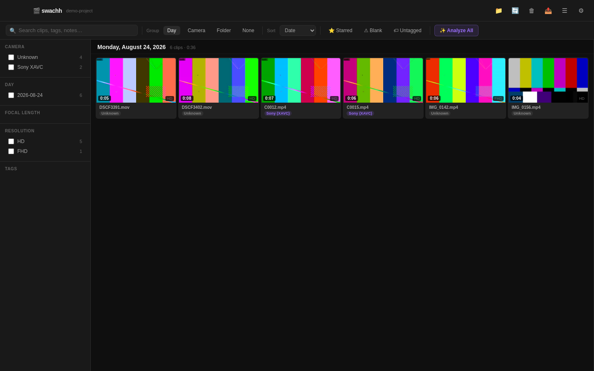
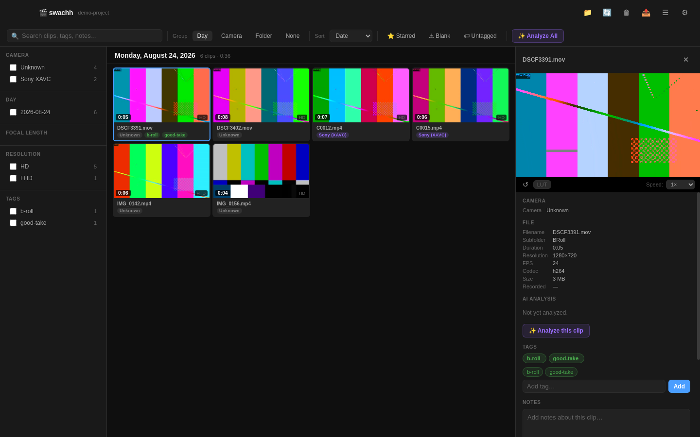
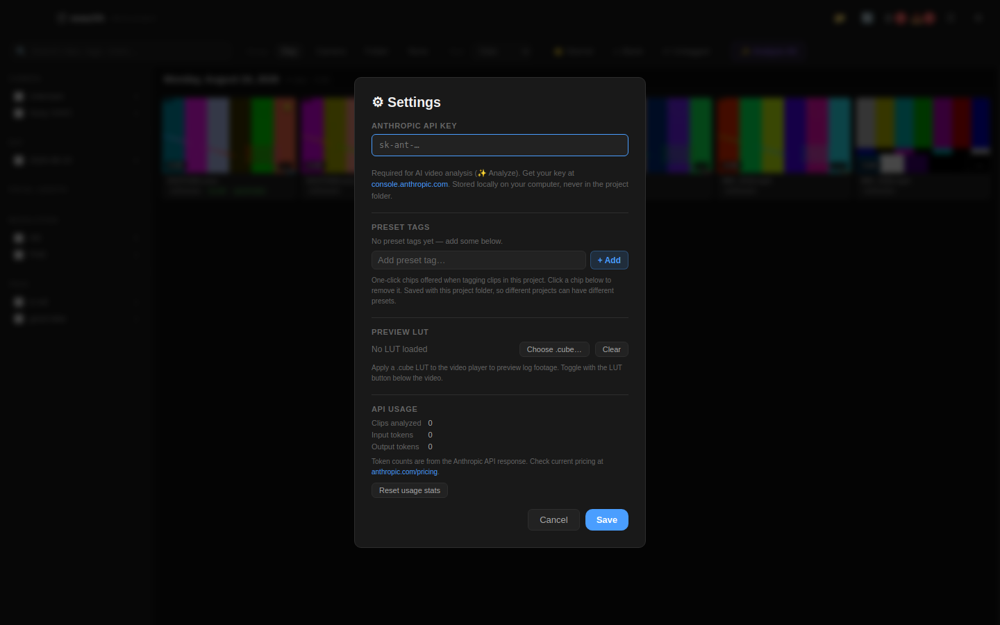

# swachh

A video organizer for editors. Browse, tag, and cull footage across any project folder — on macOS, Windows, or Linux.

Named after the Marathi/Hindi word for *clean* — स्वच्छ.

---

## What it does

swachh scans a folder of video clips, pulls out metadata (camera, date, focal length, ISO, etc.), generates thumbnail previews, and gives you a fast grid view to browse, tag, star, and cull your footage. It works completely offline — your files never leave your computer.

---

## Walkthrough



| Grid view | Clip details & tagging | Settings |
|---|---|---|
|  |  |  |

*(Screenshots above are from a sample project with placeholder test-pattern footage — your real footage will show actual video thumbnails.)*

---

## Requirements

swachh needs two things installed before it will run:

- **[Node.js](https://nodejs.org)** (18 or newer) — runs the app
- **[ffmpeg](https://ffmpeg.org/download.html)** (which includes `ffprobe`) — reads video metadata and generates thumbnails

Both are free, open-source, and used by thousands of other apps. Installation steps for each OS are below.

---

## Installation (step by step, no coding experience needed)

### Step 1 — Download the app

1. Go to the GitHub page for this project
2. Click the green **Code** button near the top right
3. Click **Download ZIP**
4. Once it downloads, unzip it
5. Move the unzipped folder (called `swachh-main` or similar) somewhere you'll remember — your Desktop or Documents folder works fine

### Step 2 — Open a terminal

You don't need to know how to code — you'll just be copying and pasting the commands below.

- **macOS**: Press **⌘ + Space**, type `Terminal`, press Enter (or find it in **Applications → Utilities**)
- **Windows**: Press **Win**, type `PowerShell`, press Enter
- **Linux**: Open your distro's terminal app (varies by desktop environment — often **Ctrl + Alt + T**)

### Step 3 — Install Node.js and ffmpeg

<details>
<summary><b>macOS</b></summary>

Install [Homebrew](https://brew.sh) first if you don't have it (paste in Terminal, press Enter, enter your password when asked):

```
/bin/bash -c "$(curl -fsSL https://raw.githubusercontent.com/Homebrew/install/HEAD/install.sh)"
```

> Already have Homebrew? Skip this. Not sure? Run `brew --version` — if you see a version number, you're set.

Then install Node and ffmpeg:

```
brew install node ffmpeg
```

</details>

<details>
<summary><b>Windows</b></summary>

Install [Node.js](https://nodejs.org) by downloading the Windows installer from nodejs.org and running it (accept the defaults).

For ffmpeg, the easiest route is [winget](https://learn.microsoft.com/windows/package-manager/winget/) (built into modern Windows) — in PowerShell:

```
winget install Gyan.FFmpeg
```

Close and reopen PowerShell afterward so it picks up the new `ffmpeg` command. If `winget` isn't available, download a build from [ffmpeg.org/download.html](https://ffmpeg.org/download.html), unzip it, and add its `bin` folder to your `PATH` (search "Edit environment variables" in the Start menu).

</details>

<details>
<summary><b>Linux</b></summary>

Use your distro's package manager, for example:

```
# Debian / Ubuntu
sudo apt install nodejs npm ffmpeg

# Fedora
sudo dnf install nodejs ffmpeg

# Arch
sudo pacman -S nodejs npm ffmpeg
```

</details>

Verify both installed correctly:

```
node --version
ffmpeg -version
```

### Step 4 — Navigate to the swachh folder

In your terminal, type `cd ` (with a space after it), then drag the swachh folder from your file manager directly into the terminal window — the path will appear automatically. Press Enter.

It should look something like:

```
cd /Users/yourname/Desktop/swachh-main       # macOS/Linux
cd C:\Users\yourname\Desktop\swachh-main     # Windows
```

### Step 5 — Install swachh's dependencies

Still in the terminal, paste this and press Enter:

```
npm install
```

This downloads the libraries swachh needs to run. It only needs to happen once. You'll see a lot of text scroll by — that's normal. Wait for it to finish (you'll see your cursor come back).

### Step 6 — Run swachh

```
npm start
```

The app will open. On first launch, click **Choose Project Folder** and point it at a folder containing video clips. swachh will scan everything recursively and generate thumbnails — this takes a minute or two depending on how much footage you have.

**Next time** you want to open swachh, just open your terminal, navigate to the folder again (Step 4), and run `npm start`.

---

## Optional: Build it as a standalone desktop app

```
npm run build
```

This creates a file at `dist/mac-arm64/swachh.app`. Drag it to your `/Applications` folder, then to your Dock, to open it like any other Mac app.

> **Note:** Packaged builds are currently macOS-only. On Windows and Linux, run swachh from source with `npm start` (Steps 4–6 above) — it works the same way, just without a double-clickable app icon. Contributions adding a Windows/Linux build target are welcome.

> **Note (macOS):** Because swachh isn't distributed through the Mac App Store, macOS may warn you the first time you open it. To get past this: right-click `swachh.app` → **Open** → **Open** again in the dialog.

---

## Optional: AI clip analysis

swachh can analyze your video clips using AI and write a description of what's happening in each clip — useful for finding footage later or getting a quick overview of a shoot.

To use this feature:
1. Get a free API key from [console.anthropic.com](https://console.anthropic.com) (you'll need to create an account and add a small amount of credit — analyzing a full shoot of ~400 clips costs roughly $1–2)
2. In swachh, click the **⚙ Settings** gear icon in the top right
3. Paste your API key and click Save
4. Open any clip and click **Analyze** — or use **Analyze All** to run on every clip at once

Your API key is stored privately on your computer and never sent anywhere except directly to Anthropic's servers.

---

## Project data

When you open a folder, swachh creates a hidden `.organizer/` subfolder inside it containing thumbnails, metadata, and your tags and notes. This data travels with your footage — if you copy the folder to an external drive, your tags come with it.

You can safely delete `.organizer/` to start completely fresh.

App-level settings (last used folder, Anthropic API key) are stored separately, outside any project folder:

| OS | Location |
|---|---|
| macOS | `~/Library/Application Support/swachh/organizer-config.json` |
| Windows | `%APPDATA%\swachh\organizer-config.json` |
| Linux | `~/.config/swachh/organizer-config.json` |

---

## Features

| | |
|---|---|
| Group by | Day, Camera, Folder |
| Filter by | Camera type, focal length, resolution, date |
| Per-clip | Tags, notes, star, mark for deletion |
| Delete flow | Mark → review list → confirm → moves to your OS Trash / Recycle Bin |
| Camera metadata | Aperture, ISO, shutter, white balance, LUT (Blackmagic/iPhone clips) |
| GPS | Links to Google Maps for geotagged clips |

## Keyboard shortcuts

| Key | Action |
|-----|--------|
| `D` | Mark / unmark for deletion |
| `S` | Star clip |
| `T` | Focus tag input |
| `← →` | Previous / next clip |
| `Space` | Play / pause |
| `F` | Toggle filter sidebar |
| `Esc` | Close detail panel |

---

## Supported cameras

Tested with:

- **iPhone via Blackmagic Cam** — full metadata (lens, aperture, ISO, shutter, WB, LUT, GPS, day/night)
- **Fujifilm X-E4** — date, resolution
- **Sony XAVC** — date, resolution
- Any other camera that produces `.mov`, `.mp4`, `.mts`, `.m2ts`, `.avi`, or `.mkv` files

> iPhone clips recorded in ProRes or HEVC will show a thumbnail preview instead of a live video player (a browser limitation). You can open them directly in your system's default video player from the detail panel.

---

## Platform notes

swachh runs the same core experience on macOS, Windows, and Linux — scanning, thumbnails, tagging, filtering, starring, and deleting all work identically everywhere. A couple of things currently differ:

- **"Show in Finder"** for a single clip works on every OS (opens your default file manager — Finder, Explorer, Nautilus, etc.) with the file selected.
- **Revealing multiple starred clips at once, pre-selected in the file manager,** currently only works on macOS (it uses AppleScript under the hood). On Windows/Linux this falls back to opening the containing folder.
- **Packaged, double-clickable builds** (`npm run build`) are macOS-only for now — see the build section above.

---

## Troubleshooting

**"command not found: node" / "'node' is not recognized"** — Node.js isn't installed or isn't on your `PATH`. Revisit Step 3 for your OS.

**"command not found: ffmpeg" / "'ffmpeg' is not recognized"** — Same as above, for ffmpeg. Run `ffmpeg -version` to confirm; reinstall if you get an error.

**App opens but shows a blank screen** — Make sure you selected a folder that actually contains video files.

**Thumbnails not generating** — ffmpeg may not be installed or not on your `PATH`. Run `ffmpeg -version` in your terminal to check.

**macOS says the app is from an unidentified developer** — Right-click `swachh.app` → Open → Open. You only have to do this once.

**Windows SmartScreen warns about an unrecognized app** — Only relevant if/when a Windows build is available; click **More info → Run anyway**.
